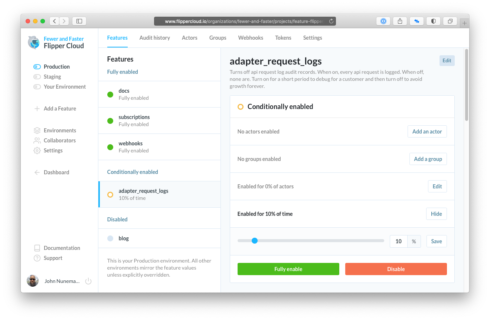

[](https://www.flippercloud.io)

# Flipper

> Beautiful, performant feature flags for Ruby.

Flipper gives you control over who has access to features in your app.

* Enable or disable features for everyone, specific actors, groups of actors, a percentage of actors, or a percentage of time.
* Configure your feature flags from the console or a web UI.
* Regardless of what data store you are using, Flipper can performantly store your feature flags.
* Use [Flipper Cloud](#flipper-cloud) to cascade features from multiple environments, share settings with your team, control permissions, keep an audit history, and rollback.

Control your software &mdash; don't let it control you.

## Installation

Add this line to your application's Gemfile:

    gem 'flipper'

You'll also want to pick a storage [adapter](#adapters), for example:

    gem 'flipper-active_record'

And then execute:

    $ bundle

Or install it yourself with:

    $ gem install flipper

## Getting Started

Use `Flipper#enabled?` in your app to check if a feature is enabled.

```ruby
# check if search is enabled
if Flipper.enabled? :search, current_user
  puts 'Search away!'
else
  puts 'No search for you!'
end
```

All features are disabled by default, so you'll need to explicitly enable them.

#### Enable a feature for everyone

```ruby
Flipper.enable :search
```

#### Enable a feature for a specific actor

```ruby
Flipper.enable_actor :search, current_user
```

#### Enable a feature for a group of actors

First tell Flipper about your groups:

```ruby
# config/initializers/flipper.rb
Flipper.register(:admin) do |actor|
  actor.respond_to?(:admin?) && actor.admin?
end
```

Then enable the feature for that group:

```ruby
Flipper.enable_group :search, :admin
```

#### Enable a feature for a percentage of actors

```ruby
Flipper.enable_percentage_of_actors :search, 2
```


Read more about enabling and disabling features with [Gates](docs/Gates.md). Check out the [examples directory](examples/) for more, and take a peek at the [DSL](lib/flipper/dsl.rb) and [Feature](lib/flipper/feature.rb) classes for code/docs.

## Adapters

Flipper is built on adapters for maximum flexibility. Regardless of what data store you are using, Flipper can performantly store data in it.

Pick one of our [supported adapters](docs/Adapters.md#officially-supported) and follow the installation instructions:

* [Active Record](docs/active_record/README.md)
* [Sequel](docs/sequel/README.md)
* [Redis](docs/redis/README.md)
* [Mongo](docs/mongo/README.md)
* [Moneta](docs/moneta/README.md)
* [Rollout](docs/rollout/README.md)

Or [roll your own](docs/Adapters.md#roll-your-own). We even provide automatic (rspec and minitest) tests for you, so you know you've built your custom adapter correctly.

Read more about [Adapters](docs/Adapters.md).

## Flipper UI

If you prefer a web UI to an IRB console, you can setup the [Flipper UI](docs/ui/README.md).

It's simple and pretty.


## Flipper Cloud

Or, (even better than OSS + UI) use [Flipper Cloud](https://www.flippercloud.io) which comes with:

* **everything in one place** &mdash; no need to bounce around from different application UIs or IRB consoles.
* **permissions** &mdash; grant access to everyone in your organization or lockdown each project to particular people.
* **multiple environments** &mdash; production, staging, enterprise, by continent, whatever you need.
* **personal environments** &mdash; no more rake scripts or manual enable/disable to get your laptop to look like production. Every developer gets a personal environment that inherits from production that they can override as they please ([read more](https://www.johnnunemaker.com/flipper-cloud-environments/)).
* **no maintenance** &mdash; we'll keep the lights on for you. We also have handy webhooks for keeping your app in sync with Cloud, so **our availability won't affect yours**. All your feature flag reads are local to your app.
* **audit history** &mdash; every feature change and who made it.
* **rollbacks** &mdash; enable or disable a feature accidentally? No problem. You can roll back to any point in the audit history with a single click.

[](https://www.flippercloud.io)

Cloud is super simple to integrate with Rails ([demo app](https://github.com/fewerandfaster/flipper-rails-demo)), Sinatra or any other framework.

## Advanced

A few miscellaneous docs with more info for the hungry.

* [Instrumentation](docs/Instrumentation.md) - ActiveSupport::Notifications and Statsd
* [Optimization](docs/Optimization.md) - Memoization middleware and Cache adapters
* [API](docs/api/README.md) - HTTP API interface
* [Caveats](docs/Caveats.md) - Flipper beware! (see what I did there)
* [Docker-Compose](docs/DockerCompose.md) - Using docker-compose in contributing

## Contributing

1. Fork it
2. Create your feature branch (`git checkout -b my-new-feature`)
3. Run the tests (`bundle exec rake`)
4. Commit your changes (`git commit -am 'Added some feature'`)
5. Push to the branch (`git push origin my-new-feature`)
6. Create new Pull Request

## Releasing

1. Update the version to be whatever it should be and commit.
2. `script/release`
3. Profit.

## Brought To You By

| pic | @mention | area |
|---|---|---|
|  | [@jnunemaker](https://github.com/jnunemaker) | most things |
|  | [@alexwheeler](https://github.com/alexwheeler) | api |
|  | [@thetimbanks](https://github.com/thetimbanks) | ui |
|  | [@lazebny](https://github.com/lazebny) | docker |
